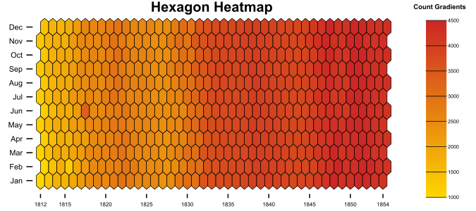
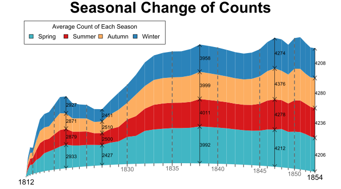
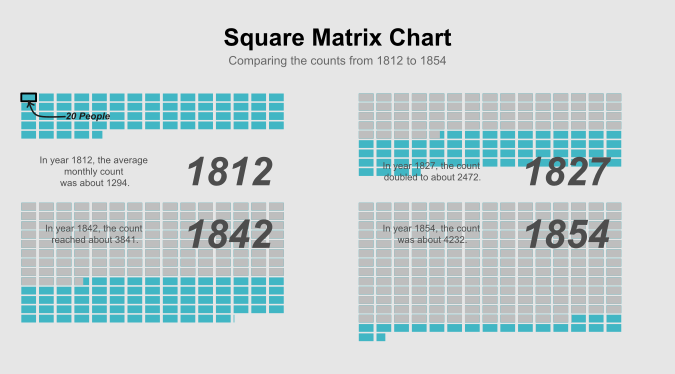

# R Base Plotting

Plot charts using R base plotting functions.  
A good method to understand charts.  
Inspired by one of the modules taken at _University of Warwick_.  
Using data from R package `HistData`.  

```{r}
require HistData
```

## Coorelation Charts

+ Hexagon Heatmap


## Evolution Charts

+ Stacked Area Chart, w/ curved axis


## Other Charts

+ Square Matrix Chart


## References

+ [The R Graph Gallery](https://www.r-graph-gallery.com/)